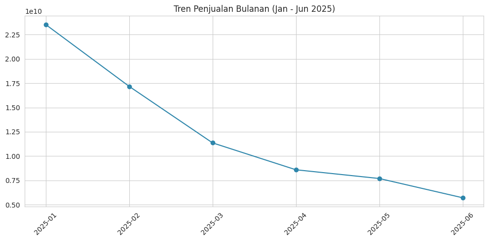
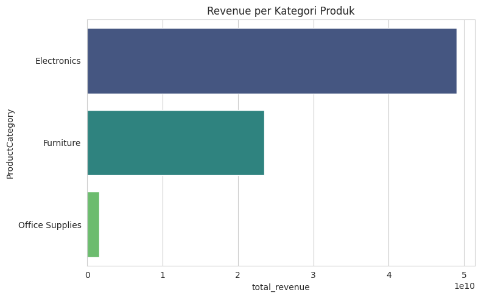
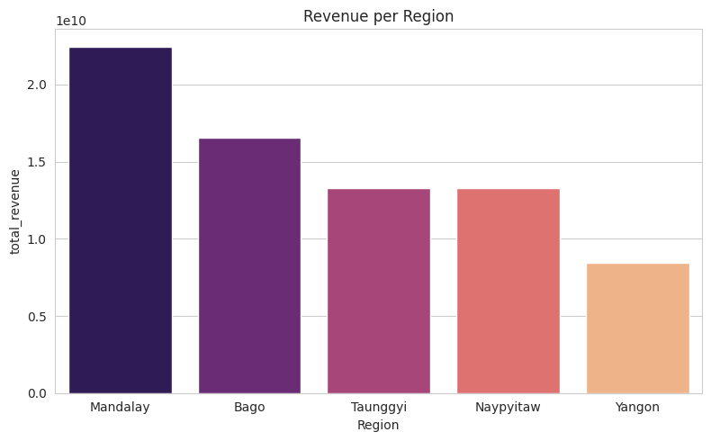
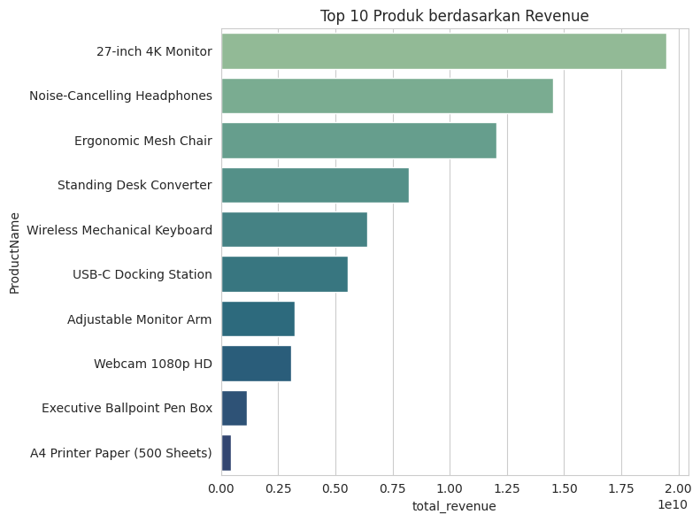
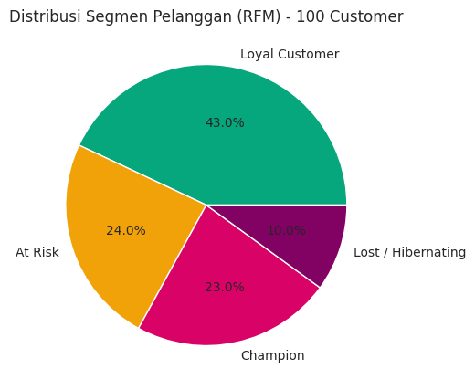
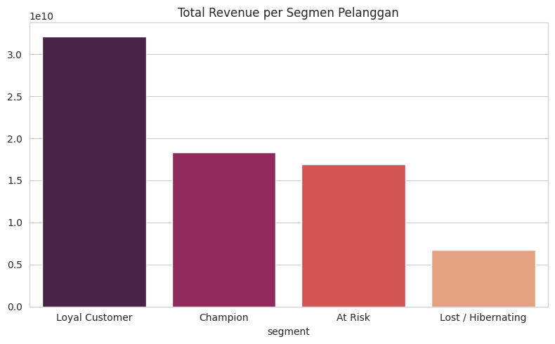
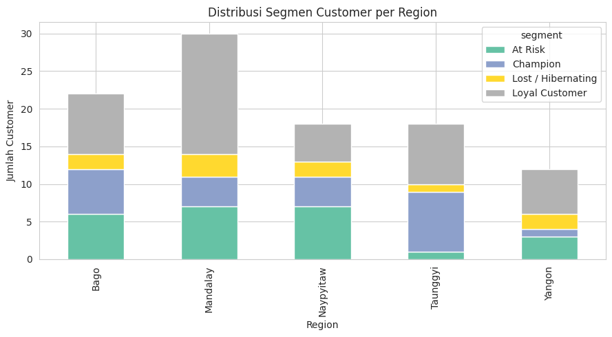

# Customer Segmentation Analysis using RFM Method

## 📌 Background
This project analyzes 30,000 retail transactions from 100 customers across
5 regions in Myanmar (Yangon, Mandalay, Bago, Naypyitaw, Taunggyi) during
January–June 2025. The goal is to understand sales patterns and segment
customers using the RFM (Recency, Frequency, Monetary) method to identify
which customers are most valuable and which are at risk of churning.

## 🧹 Data Cleaning Process
The raw dataset had a non-standard structure: Customer ID and Region were
stored as separate "marker rows" interspersed between transaction rows,
rather than as dedicated columns per transaction. To address this, a
**forward-fill technique** was applied in Excel to reconstruct a proper
transactional table, where each row carries its own Customer ID and Region.
Additional cleaning steps included parsing a non-standard date format
(DD.MM.YYYY) and converting text-formatted numeric fields (with comma
thousand-separators) into proper numeric values.

## ❓ Business Questions
1. Which product categories and products generate the most revenue?
2. Which region contributes the most revenue?
3. How did sales trend over the six-month period?
4. How can customers be segmented based on RFM, and what does each
   segment suggest about customer behavior?
5. Is there a relationship between region and customer loyalty?

## 🛠️ Tools
- **Excel** — data exploration, forward-fill technique, data cleaning
- **Microsoft SQL Server (SSMS)** — business query analysis and RFM
  scoring using window functions (NTILE)
- **Python (Pandas, Matplotlib, Seaborn)** — data visualization and
  customer segmentation logic

## 📊 Key Findings

**1. Sharp and consistent revenue decline**
Revenue dropped from approximately Rp23.5 billion in January to Rp5.7
billion in June 2025 — a decrease of roughly 76% over six months.
Transaction volume followed the same pattern, falling from 9,492 to 2,247
transactions. The decline was monotonic every month with no recovery,
suggesting a structural issue such as customer churn rather than seasonal
fluctuation.

**2. Electronics drives the majority of revenue**
Electronics generated approximately Rp49 billion in revenue, more than
double Furniture (~Rp23.5 billion) and far ahead of Office Supplies
(~Rp1.5 billion). The 27-inch 4K Monitor alone contributed ~Rp19.5
billion, making it the single best-performing product.

**3. Mandalay leads in regional revenue, Yangon lags behind**
Mandalay generated the highest revenue (~Rp22.5 billion), followed by
Bago (~Rp16.5 billion). Yangon, despite typically being a major
commercial hub, trailed all other regions (~Rp8.5 billion).

**4. Nearly a quarter of customers are at risk of churning**
RFM segmentation of the 100 customers showed: 43% Loyal Customers, 24%
At Risk, 23% Champions, and 10% Lost/Hibernating. While Loyal Customers
make up the largest group, they also contribute the largest share of
revenue (~Rp32 billion) — making them the highest-priority segment to
retain, especially given the overall revenue decline.

**5. Regional differences in customer health**
Taunggyi shows an unusually strong customer base, with half of its
customers classified as Champions and very few At Risk or Lost. In
contrast, Yangon — the lowest-revenue region — has a comparatively
higher share of Lost/Hibernating customers, which may help explain its
underperformance.

## 💡 Business Recommendations
1. **Investigate the root cause of the revenue decline** — determine
   whether it stems from customer churn, reduced purchase frequency, a
   competitor entering the market, or an internal operational issue,
   given the consistency of the monthly drop.
2. **Launch a retention campaign targeting At Risk customers** (24% of
   the customer base), since losing this segment would further
   accelerate the revenue decline already observed.
3. **Replicate Taunggyi's success in other regions**, particularly
   Yangon — investigate what differentiates Taunggyi's customer
   engagement and consider applying similar strategies elsewhere.
4. **Protect and reward Loyal Customers**, as they are both the largest
   segment and the largest revenue contributor; a loyalty program could
   help prevent them from sliding into the At Risk category.

## 📁 Repository Structure
- `data/` — raw and cleaned transaction datasets
- `data/query_results/` — output CSV from SQL queries, used as input for the Python visualization notebook
- `sql/queries.sql` — all SQL Server queries used for analysis and RFM
  scoring
- `notebook/analysis.ipynb` — Python notebook for visualization and
  customer segmentation
- `images/` — exported chart visualizations

## 📈 Visualizations

